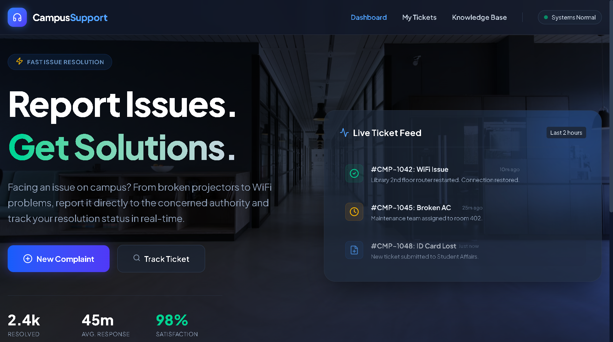

<div align="center">

  

  <br />
  <p><strong>A modern, glassmorphism-based frontend application for submitting and tracking campus complaints and issues.</strong></p>

  <p>
    
    
    
  </p>

</div>

---

## 🚀 Live Demo

🔥 **Check out the live project here:** 🔗 **[CampusSupport Live App](https://atul-dev-ai.github.io/campus-support/)**

 

---

## ✨ Key Features

- **Frosted Glassmorphism UI:** Premium translucent design for the navbar, footer, and right-side tracking cards over a deep, immersive background.
- **Interactive Ticket Modal:** A smooth, animated popup form for submitting complaints with category selection and simulated file uploads.
- **Simulated Form Submission:** Built-in JavaScript logic that simulates API loading states with a spinner, followed by a success message and auto-close functionality.
- **Live Ticket Feed:** A dynamic-looking right panel displaying recent campus complaints and their resolution statuses in real-time.
- **Fully Responsive:** Perfectly optimized for mobile, tablet, and desktop views with a sleek custom mobile dropdown menu.
- **Developer Showcase:** Features a large, beautifully designed developer bio section in the footer.

---

## 🛠️ Tech Stack

- **Markup:** HTML5
- **Styling:** Tailwind CSS (via CDN)
- **Icons:** Lucide Icons
- **Scripting:** Vanilla JavaScript (DOM Manipulation, Event Handling, & Animations)

---

## 💻 Run Locally on Your Machine

Follow these steps to run and edit this project on your local computer:

**1. Clone the repository:**
  ```bash
  git clone [https://github.com/atul-dev-ai/campus-support.git](https://github.com/atul-dev-ai/campus-support.git)
  ```

  ```bash
  cd campus-support
  ```

## 2. Open the Project:
Simply double-click the index.html file to open it in your web browser. Alternatively, use VS Code's "Live Server" extension for hot-reloading.

---

## 👨‍💻 About the Developer
Developed with ❤️ by Atul Paul.

I am a software developer and student at Daffodil International University (DIU), with a strong passion for Web Development, Generative AI, and Deep Learning.

📫 Connect with me:

GitHub: @atul-dev-ai

LinkedIn: Paul Atul

<p align="center">
<i>If you find this UI helpful, please consider giving it a ⭐ on GitHub!</i>
</p>
